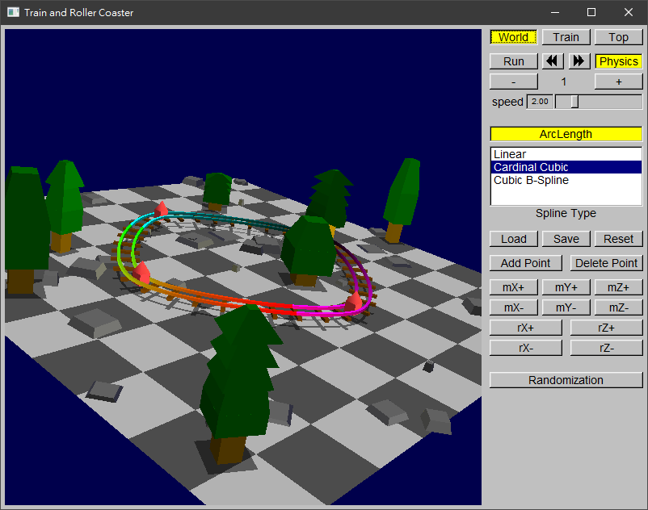
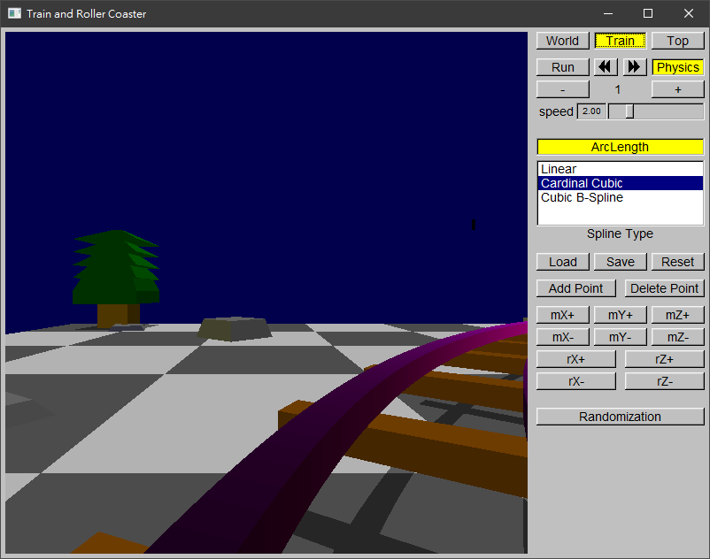
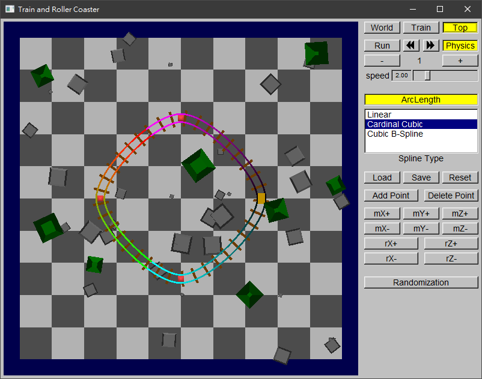
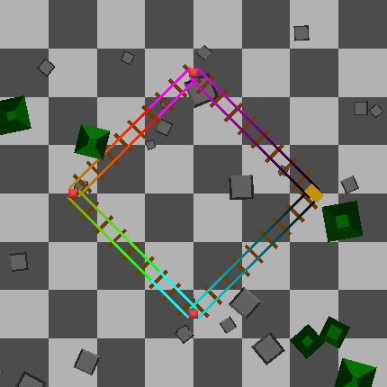
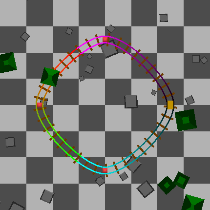
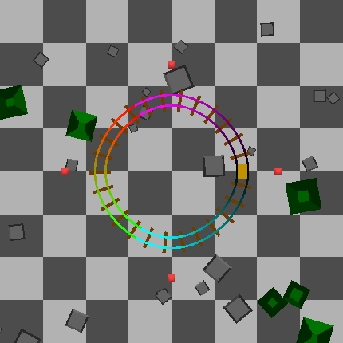
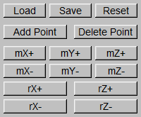
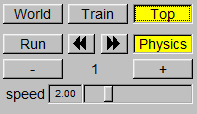
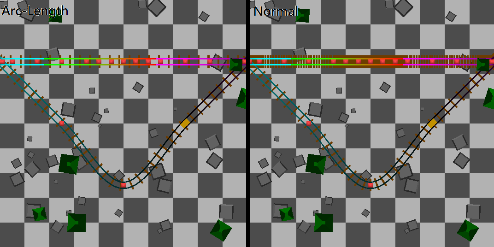

#  Roller Coasters

## Table of Contents

* [Requirement](#requirement)
* [Build](#build)
* [Run](#run)
	- [Camera](#camera)
	- [Spline](#spline)
		+ [Type](#spline-type)
		+ [Point Control](#spline-point-control)
	- [Train](#train)
* [Develop Documentation](#develop-documentation)
	- [Arc length](#arc-length)

## Requirement

Please install the following programs before building. 

* [MinGW]
* [CMake]
* [FLTK]

Then, download the latest version header of [OpenGL] and add it to your compiler search path.

Then, install the following library and add it to your compiler search path.

* [FreeGLUT]
* [GLEW]
* [GLM]

If you don't know how to set up your library, you can find a step-by-step tutorial at [here](https://medium.com/@bhargav.chippada/how-to-setup-opengl-on-mingw-w64-in-windows-10-64-bits-b77f350cea7e
).

[MinGW]: https://osdn.net/projects/mingw/
[CMake]: https://cmake.org/
[FLTK]: https://www.fltk.org/
[FreeGLUT]: http://freeglut.sourceforge.net/
[GLEW]: http://glew.sourceforge.net/
[GLM]: http://glm.g-truc.net

## Build

Run `cmake -G "MinGW Makefiles -B build ."` first,

and run `make all` in `build` folder.

## Run

All executable files can be run in console without argument.

### Camera

Provide 3 different perspectives camera to use.

### Spline
#### Spline Type

Provide 3 different spline method to use.
Where Cubic B-Spline conform C1 / G1.

#### Spline Point Control

* Move / Rotate selected control point.
* Add one more point to map.
* Remove one less point from map. (at lest 4 points)
* Save map to file
* Load map from file.

### Train

* Add one more car to train. (at most 20 car)
* Remove one less car from train. (at lest 1 car)
* Physics system supported.
	- Prevent speed out of control, train have a minimum and maximum speed.

## Develop Documentation
### Arc length

Same concept as numerical integration.

